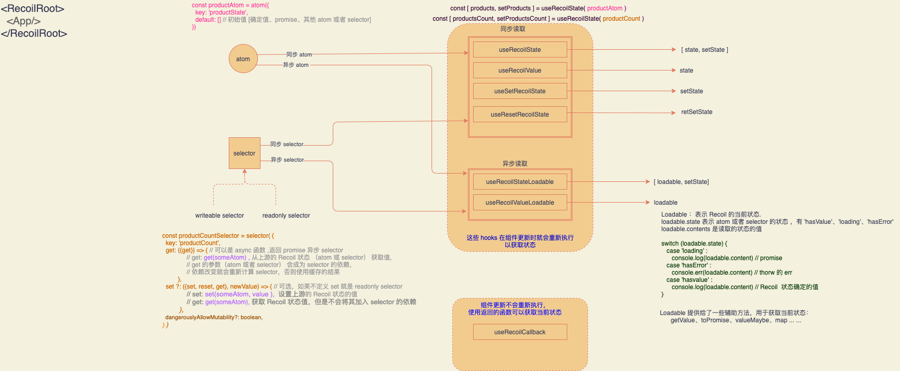

Recoil 还在实验阶段，不能在生产环境使用。目前文章分析的版本是 0.0.13

### 特性

- Hooks 组件的状态管理。目前不能在类组件里面使用。使用 useHooks 读写状态和订阅组件。

- 支持 ts。

- 向后兼容 React，支持 React 并行模式。

  > 并行模式实际上不是把页面渲染和响应用户交互放在不同的线程去并行执行，而是把渲染任务分成多个时间片，在用户输入的时候可以暂停渲染，达到近似并行的效果。

  

- Recoil 的状态和衍生状态都既可以是同步的也可以是异步的，可结合 `<suspense>`处理异步状态，也可以用 recoil 暴露的 loadable。

  > React `<suspense>`用于代码分片和异步获取数据
  >
  > ```js
  > 
  > const Clock = React.lazy(() => {
  >     console.log("start importing Clock");
  >     return import("./Clock");
  > });
  > 			
  > <Suspense fallback={<Loading />}>
  >   { showClock ? <Clock/> : null}
  > </Suspense>
  > 
  > ```

  

- 分散（原子化）的状态管理，打平状态树，实现精确的组件更新通知。这样可以避免一处更新，全量渲染。可以对比 Redux 的单一 store ，在 select state 的时候就需要自顶向下逐层读取，一个 state 改变，全部订阅 store 的组件都会收到更新通知。

  >  Recoil state tree 与组件树正交，正交线就是使用 Recoil state 的组件为点连成的线，减小了 state tree 与组件树的接触面，也就说 state 只会影响订阅它的组件。而且，正交线上的不同的组件属于不同 state 的子节点，state 之间不会相互影响其他 state 订阅的组件。
  >
  > Recoil state tree 与组件树正交 [[1]](#图1) :
  >
  > 


### 如何使用

Recoil demo："shope cart"

实现购物车功能，获取商品列表、添加商品到购物车、提交订单。这里面涉及到在商品列表里面添加到购物车时，购物车组件和商品列表组件要共享购物车状态，订单组件要和购物车组件共享订单状态，还有请求商品列表和提交订单请求涉及到的异步状态的处理。下面是这个 demo 的预览图：


先来实现简单的获取商品列表、提交到购物车、添加订单的功能。提交订单的功能在后面单独文字解释原理。

##### 定义 Recoil state:

Src/Store/atom.ts

```js
import {atom} from 'recoil'
import { getProductList } from '../service'
import { ProductItem, CartState, OrderItem, OrderState } from '../const'

// 商品 state
export const productAtom = atom<Array<ProductItem>>({
  key: 'productState',
  default: (async () => {
    const res: any = await getProductList()
    return res.data.products
  })() // 返回 promise
})

// 购物车 state
export const cartAtom = atom<CartState>({
  key: 'cartState',
  default: []
})

// 订单 state
export const orderAtom = atom<OrderState>({
  key: 'orderState',
  default: []
})

```

Src/store.selector.ts

```js
import { orderAtom } from './atoms'
import { selector} from 'recoil'

// 计算订单总价，属于订单状态的衍生状态
export const myOrderTotalCost = selector<number>({
  key: 'myOrderTotalPrice',
  get: ({ get }) => {
    const order = get(orderAtom)
    return order.reduce((total, orderItem) => total + orderItem.price * orderItem.quantity, 0)
  }
})
```


##### 定义 usehooks，usehooks 封装更新购物车和订单的逻辑，以便跨组件复用

Src/store/hooks.ts

```js
import { useEffect, useState } from 'react'
import {
  useRecoilState,
  useSetRecoilState,
  useResetRecoilState,
  Loadable,
  useRecoilValue,
  useRecoilStateLoadable,
  RecoilState,
  SetterOrUpdater
} from 'recoil'
import { cartAtom, orderAtom, orderWillSubmitAtom, orderIDHadSubmitAtom } from './atoms'
import {submitOrderRes} from './selector'
import {produce} from 'immer'
import { ProductItem, CartItem, CartState, OrderItem, OrderState, LoadableStateHandler } from '../const'

// 添加商品到 cart
export function useAddProductToCart() {
  const [cart, setCart] = useRecoilState<CartState>(cartAtom)
  const addToCart = (item: ProductItem) => {
    const idx = cart.findIndex(cartItem => item.id === cartItem.id) 
    if (idx === -1) {
      const newItem = {...item, quantity: 1}
      setCart([...cart, newItem])
    } else {
      setCart(produce(draftCart => {
        const itemInCart = draftCart[idx]
        itemInCart.quantity ++
      }))
    }
  }
  return [addToCart]
}

// 减少 cart 里的商品的数量
export function useDecreaseProductIncart() {
  const setCart = useSetRecoilState<CartState>(cartAtom)
  const decreaseItemInCart = (item: CartItem) => {
    setCart(produce(draftCart => {
      const {id} = item
      draftCart.forEach((item: CartItem, idx: number, _draftCart: CartState) => {
        if(item.id === id) {
          if (item.quantity > 1) item.quantity --
          else if (item.quantity === 1) {
            draftCart.splice(idx, 1)
          }
        }
      })
    }))
  }
  return [decreaseItemInCart]
}

// 删除 cart 里的商品
export function useRemoveProductIncart() {
  const setCart = useSetRecoilState<CartState>(cartAtom)
  const rmItemIncart = (item: CartItem|ProductItem) => {
    setCart(produce(draftCart => {
      draftCart = draftCart.filter((_item: CartItem) => _item.id !== item.id)
      return draftCart
    }))
  }
  return [rmItemIncart]
}

// 将 cart 里的商品加到订单
export function useAddProductToOrder() {
  const setOrder = useSetRecoilState<OrderState>(orderAtom)
  const [rmItemIncart] = useRemoveProductIncart()
  const addToOrder = (item: CartItem) => {
    setOrder(produce(draftOrder => {
      draftOrder = [...draftOrder, {...item, orderID: Math.random()}]
      return draftOrder
    }))
    // 从购物车删除掉
    rmItemIncart(item)
  }
  return [addToOrder]
}
```


##### 在商品、购物车、订单组件里面引入 Recoil state 和 useHooks，使组件订阅 Recoil state

这里只给出商品列表组件，限于篇幅，购物车和订单组件订阅 Recoil state 的方法与商品列表组件类似

src/pages/product.tsx

```js
import React from 'react'
import {useRecoilValueLoadable, useRecoilValue} from 'recoil'
import {productAtom, cartAtom} from '../store/atoms'
import {useAddProductToCart, useRemoveProductIncart} from '../store/hooks'
import { ProductItem } from '../const'
import '../style/products.css'

function ProductListLoadable(): JSX.Element {
  // productsLoadable 会被缓存，即商品请求结果会被缓存，
  // 重复使用 useRecoilValueLoadable(productAtom) 不会发起重复请求
  const productsLoadable = useRecoilValueLoadable(productAtom)
  const cart = useRecoilValue(cartAtom)
  const [addToCart] = useAddProductToCart()
  const [rmItemInCart] = useRemoveProductIncart()

  // 可以用 React 的 Suspense 代替下面的 switch 来处理异步状态
  switch (productsLoadable.state) {
    case 'hasValue': 
      const products: Array<ProductItem> = productsLoadable.contents
      return <div>
        {
          products
          .map((product:ProductItem) => 
            <div key={product.id} className="product-item">
              <div></div>
              <div>{product.name}</div>
              <div>{product.price} 元</div>
              {
                cart.findIndex(
                  itemCart => itemCart.id === product.id
                ) === -1
                ?
                <div className='add-to-cart' onClick={() => addToCart(product)}>
                  加入购物车
                </div>
                :
                <div className='rm-in-cart' onClick={() => rmItemInCart(product)}>
                  从购物车删除
                </div>
              }
            </div>
          )
        }
      </div>
    case 'hasError':
      return <div>请求出错</div>
    case 'loading': 
    default: 
      return <div style={{textAlign: 'center'}}>正在加载中......</div>
  }
}

export default function ProductList() {
  return <div>
    <h3>
      <i className="fas fa-store-alt"></i>
      商品列表
    </h3>
    <ProductListLoadable/>
  </div>
}
```


代码里面省略了提交订单的部分，这里单独文字讲述利用 Recoil selector 实现这部分功能的原理：因为 selector 是一个纯函数，而且 selector 会订阅其他 atom 或者 selector ，当订阅的数据发生变化，selector 会自动执行 get，返回结果，所以可以定义一个待提交的订单的 atom 叫做 `orderWillSubmitAtom`，当向这个 atom 添加订单，那么依赖这个atom  的 selector 会自动获取这个订单并执行订单提交请求，最后我们在定义一个 useHooks，用于处理这个 selector 的返回值。所以最后提交订单的这个功能，只需要把提交订单到 `orderWillSubmitAtom` 的 api 暴露给 UI 组件即可，达到 UI 与逻辑分离。

### 基本 API




下面来结合源码分析核心 api 

#### 1.` <RecoilRoot/>`

用法：

```js
<RecoilRoot>
  <App/>
</RecoilRoot>
```

Recoil 状态的上下文，可以有多个 `<RecoilRoot/>`共存，如果几个`<RecoilRoot/>`嵌套，那么里面 `<RecoilRoot/>` 的 Recoil state 会覆盖外面的同名的 Recoil state 。Recoil state 的名字由 key 确定，也就是`atom` 和 `selector` 的 key 值。在一个 `<RecoilRoot/>`中每个 `atom` 和 `selector` 的 key 值应该是唯一的。

`<RecoilRoot/>`使用 React Context 初始化 Recoil state 上下文：

```js
// 中间省略部分代码
const AppContext = React.createContext<StoreRef>({current: defaultStore});
const useStoreRef = (): StoreRef => useContext(AppContext);

function RecoilRoot({
  initializeState_DEPRECATED,
  initializeState,
  store_INTERNAL: storeProp, // For use with React "context bridging"
  children,
}: Props): ReactElement {
  
    // 中间省略部分代码
  
    const store: Store = storeProp ?? {
      getState: () => storeState.current,
      replaceState,
      getGraph,
      subscribeToTransactions,
      addTransactionMetadata,
    };
   const storeRef = useRef(store);
  
    storeState = useRef(
      initializeState_DEPRECATED != null
        ? initialStoreState_DEPRECATED(store, initializeState_DEPRECATED)
        : initializeState != null
        ? initialStoreState(initializeState)
        : makeEmptyStoreState(),
   );
  
    // ... 
  
    // Cleanup when the <RecoilRoot> is unmounted
    useEffect(
      () => () => {
        for (const atomKey of storeRef.current.getState().knownAtoms) {
          cleanUpNode(storeRef.current, atomKey);
        }
      },
      [],
    );

    return (
        <AppContext.Provider value={storeRef}>
          <MutableSourceContext.Provider value={mutableSource}>
            <Batcher setNotifyBatcherOfChange={setNotifyBatcherOfChange} />
            {children}
          </MutableSourceContext.Provider>
        </AppContext.Provider>
    );
}

module.exports = {
  useStoreRef,
  // 。。。
  RecoilRoot,
  // 。。。
};
```


`<RecoilRoot/>`包裹的子组件能调用 `useStoreRef` 获取到放在 context value 里的 store，源码里有两层 Context.provider，主要看第一层 `<AppContext.Provider value={storeRef}>`。

> 第二层 `<MutableSourceContext.Provider value={mutableSource}>`是为了在未来兼容 React 并发模式而新近增加的，它在跨 React 根组件共享 Recoil 状态时，从 Recoil 状态上下文中分离出可变源以单独保存（ [`Separate context for mutable source #519`](https://github.com/facebookexperimental/Recoil/pull/519)），可变源就是指除开 React state、Recoil state 这些不可变状态之外的数据来源，比如 window.location 。这个和 React 新 API `useMutableSource()`有关，`useMutableSource()`是为了在 React 的并发模式下能够安全和高效的订阅可变源而新加的，详情移步 [useMutableSource RFC](https://github.com/bvaughn/rfcs/blob/useMutableSource/text/0000-use-mutable-source.md)。


`<AppContext.Provider value={storeRef}>`里面 `storeRef` 就是 Recoil state 上下文，它由`React.useRef()`生成，也就是把 Recoil state 放在 `ref.current`，所以子组件获取 store 的方式就是使用 `useStoreRef().current`


当 `<RecoilRoot/>`卸载时清除 Recoil state 避免内存泄漏：

```js
// Cleanup when the <RecoilRoot> is unmounted
  useEffect(
    () => () => {
      for (const atomKey of storeRef.current.getState().knownAtoms) {
        cleanUpNode(storeRef.current, atomKey);
      }
    },
    [],
  );
```

还有一个组件 `<Batcher setNotifyBatcherOfChange={setNotifyBatcherOfChange} />` 用于在每次更新 Recoil state 的时候通知组件更新，具体的原理下面会讲到。

#### 2.Recoil state： `atom`、`selector`

用法：

```js
const productAtom = atom({
  key: 'productState',
  default: []
})
```

```js
const productCount = selector({
  key: 'productCount',
  get: ({get}) => {
    const products = get(productAtom)
    return products.reduce((count, productItem) => count + productItem.count, 0)
  },
  set?:({set, reset, get}, newValue) => {
  	set(productAtom, newValue)
	}
})
```


`atom` 即 Recoil state。`atom `的初始值在 default 参数设置，值可以是 确定值、Promise、其他 atom、 selector。`selector` 是纯函数，用于计算 Recoil state 的派生数据并做缓存。`selector`是 Recoil derived state (派生状态)，它不仅仅可以从 `atom `衍生数据，也可以从其他 `selector` 衍生数据。 `selector` 的属性 get 的回调函数 get 的参数*（参数为 atom或者selector）*会成为 `selector` 的依赖 ，当依赖改变的时候，`selector` 就会重新计算得到新的衍生数据并更新缓存。如果依赖不变就用缓存值。selector  的返回值由 get 方法返回，可以返回计算出的确定的值，也可以是 Promise、其他 selector、atom, 如果 `atom`和`selector`的值是 Promise ，那么表示状态值是异步获取的，Recoil 提供了专门的 api 用于获取异步状态，并支持和 React suspense 结合使用显示异步状态。 

`atom` 和 `selector`都有一个 key 值用于在 Recoil 上下文中唯一标识。key 值在同一个 `<RecoilRoot>`上下文里必须是唯一的。

判断依赖是否改变：由于依赖根本上就是 atom，所以当设置 atom 值的时候就知道依赖改变了，此时就会触发 selector 重新计算 get。下面的 `myGet` 就是 `selector` 的 get:

```js
 function myGet(store: Store, state: TreeState): [DependencyMap, Loadable<T>] {
    initSelector(store);

    return [
      new Map(),
      detectCircularDependencies(() => 
        getSelectorValAndUpdatedDeps(store, state),
      ),
    ];
  }
```


`getSelectorValAndUpdatedDeps` 执行后返回装载了衍生数据计算结果的 loadable，如果有缓存就返回缓存，没有缓存就重新计算：

```js
function getSelectorValAndUpdatedDeps(
    store: Store,
    state: TreeState,
  ): Loadable<T> {
    const cachedVal = getValFromCacheAndUpdatedDownstreamDeps(store, state);

		// 如果有缓存
    if (cachedVal != null) {
      setExecutionInfo(cachedVal);
      return cachedVal;
    }

    // 省略了一些代码

		// 没有缓存
		return getValFromRunningNewExecutionAndUpdatedDeps(store, state);
  }
```


进到上面最后一行的函数 `getValFromRunningNewExecutionAndUpdatedDeps(store, state)`，它用于计算 selector 的 属性 get 的回调函数 get ，计算出新值，缓存新值，同时更新依赖：

```js
function getValFromRunningNewExecutionAndUpdatedDeps(
    store: Store,
    state: TreeState,
  ): Loadable<T> {
    const newExecutionId = getNewExecutionId();

		// 计算 selector 的 get ，返回装载了新的计算结果的 loadable
    const [loadable, newDepValues] = evaluateSelectorGetter(
      store,
      state,
      newExecutionId,
    );

    setExecutionInfo(loadable, newDepValues, newExecutionId, state);
    maybeSetCacheWithLoadable(
      state,
      depValuesToDepRoute(newDepValues),
      loadable,
    );
    notifyStoreWhenAsyncSettles(store, loadable, newExecutionId);

    return loadable;
  }
```


#### 3. 设置和获取 Recoil state 的 hooks API ：

暴露出来的用于获取和设置 Recoil state 的 Hooks：

- 读 Recoil state：`useRecoilValue`、`useRecoilValueLoadable`
- 写 Recoil state：`useSetRecoilState`、`useResetRecoilState`
- 读和写 Recoil state：`useRecoilState`、`useRecoilStateLoadable`、`useRecoilCallback`

其中 `useRecoilState` = `useRecoilValue` + `useSetRecoilState`，后两个就是获取 Recoil state 的只读状态值和设置状态值。

`useResetRecoilState` 用于重置 Recoil state 为初始状态，也就是 default 值。

`useRecoilStateLoadable` 用于获取异步状态和设置状态，`useRecoilValueLoadable` 只读异步状态

`useRecoilCallback `：上面的几个 api 都会让组件去订阅 state，当 state 改变组件就会更新，但是使用 `useRecoilCallback `  可以不用更新组件。 `useRecoilCallback ` 允许组件不订阅 Recoil state 的情况下获取和设置 Recoil state，也就说组件可以获取 state 但是不用更新，反过来组件不必更新自身才能获取新 state，将读取 state 延迟到我们需要的时候而不是在组件 monted 的时候。

用法：

```js
const [products, setProducts] = useRecoilState(productAtom)
```

我们以 `useRecoliState`举例，看一下 Recoil 中设置 Recoil state 值走的流程：

```js
// Recoil_Hooks.ts

function useRecoilState<T>(
  recoilState: RecoilState<T>,
): [T, SetterOrUpdater<T>] {
    if (__DEV__) {
      // $FlowFixMe[escaped-generic]
      validateRecoilValue(recoilState, 'useRecoilState');
    }
    return [useRecoilValue(recoilState), useSetRecoilState(recoilState)];
}
```

`useRecoiState `  返回 ` useRecoilValue`, `useSetRecoilState`。分别看一下后面两个。

##### `useSetRecoilState`  设置 Recoil state

​          首先用于设置状态的  `useSetRecoilState`，看它是怎么把新状态更新到 store，下面是这个过程的调用链 ：

1. `useSetRecoilState` 调用 `setRecoilValue`，调用 `<RecoilRoot>` 的 `useStoreRef()`获取 Recoil state 上下文，即 store，可以看到实际上 `useSetRecoilState` 返回的 setter 除了可以传入新的状态值，也可以传入一个回调函数，后者返回新的状态值：

```js
function useSetRecoilState<T>(recoilState: RecoilState<T>): SetterOrUpdater<T> {
  if (__DEV__) {
    // $FlowFixMe[escaped-generic]
    validateRecoilValue(recoilState, 'useSetRecoilState');
  }
  const storeRef = useStoreRef();
  return useCallback( // 返回 setter 
    (newValueOrUpdater: (T => T | DefaultValue) | T | DefaultValue) => {
      setRecoilValue(storeRef.current, recoilState, newValueOrUpdater);
    },
    [storeRef, recoilState],
  );
}
```

2. `setRecoilValue`调 `queueOrPerformStateUpdate`:

```js
function setRecoilValue<T>(
  store: Store,
  recoilValue: AbstractRecoilValue<T>,
  valueOrUpdater: T | DefaultValue | (T => T | DefaultValue),
): void {
  queueOrPerformStateUpdate(
    store,
    {
      type: 'set',
      recoilValue,
      valueOrUpdater,
    }, // action
    recoilValue.key,
    'set Recoil value',
  );
}
```

3. `queueOrPerformStateUpdate` 调 `applyActionsToStore`，这里会把更新排队或者立即执行更新，排队是为了批处理多个更新，由于批处理 API 暂时被标记为 unstable，所以这里不分析，只看立即更新:

```js
function queueOrPerformStateUpdate(
  store: Store,
  action: Action<mixed>,
  key: NodeKey,
  message: string,
): void {
  if (batchStack.length) {// 排队批处理
    const actionsByStore = batchStack[batchStack.length - 1];
    let actions = actionsByStore.get(store);
    if (!actions) {
      actionsByStore.set(store, (actions = []));
    }
    actions.push(action);
  } else { // 立即更新
    Tracing.trace(message, key, () => applyActionsToStore(store, [action])); 
   // 执行 applyActionsToStore
  }
}
```

4. `applyActionsToStore` 调 `applyAction`：

```js
function applyActionsToStore(store, actions) {
  store.replaceState(state => {
    const newState = copyTreeState(state);
    for (const action of actions) {
      applyAction(store, newState, action);
    }
    invalidateDownstreams(store, newState);
    return newState; 
  });
}

// 。。。。。

function copyTreeState(state) {
  return {
    ...state,
    atomValues: new Map(state.atomValues),
    nonvalidatedAtoms: new Map(state.nonvalidatedAtoms),
    dirtyAtoms: new Set(state.dirtyAtoms),
  };
}
```

```js
// store.replaceState
const replaceState = replacer => {
    const storeState = storeRef.current.getState();
    startNextTreeIfNeeded(storeState);// 
    // Use replacer to get the next state:
  
    const nextTree = nullthrows(storeState.nextTree); 
    // nextTree: The TreeState that is written to when during the course of a transaction
    // (generally equal to a React batch) when atom values are updated.
  
    let replaced;
    try {
      stateReplacerIsBeingExecuted = true;
      
      // replaced 为新的 state tree
      replaced = replacer(nextTree); 
      
    } finally {
      stateReplacerIsBeingExecuted = false;
    }
  
    // 如果新、旧 state tree 浅比较相等，就不更新组件
    // 实际上，如果不是批处理更新，这里 replaced 、nextTree 引用不可能相等
    if (replaced === nextTree) {
      return;
    }

    if (__DEV__) {
      if (typeof window !== 'undefined') {
        window.$recoilDebugStates.push(replaced); // TODO this shouldn't happen here because it's not batched
      }
    }

  	// 如果新、旧 state tree 浅比较不相等，就更新组件，更新会被 React 推入调度
    // Save changes to nextTree and schedule a React update:
    storeState.nextTree = replaced; // 更新 state tree
		// 通知订阅了 state 的组件更新
    nullthrows(notifyBatcherOfChange.current)(); //  notifyBatcherOfChange.current() 就是 setState({})
  };


```


5. `applyAction` 调 `setNodeValue`，后者返回 depMap 和 writes，从下面的分析中知道 depMap 就是一个空的 `new Map()`，writes 也是 Map，但是不是空 Map，而是设置了一个元素，元素的 key 是 atom key，value 是 一个 Loadable，Loadable 中装载了 atom 的状态值 :

```js
function applyAction(store: Store, state: TreeState, action: Action<mixed>) {
  if (action.type === 'set') {
    const {recoilValue, valueOrUpdater} = action;
    // 读取 state value，如果是一个函数就会执行函数返回 value
    const newValue = valueFromValueOrUpdater(
      store,
      state,
      recoilValue,
      valueOrUpdater,
    );
    // 返回 nodes ，nodes 是一个 Map ，用来存储 Recoil state，每一个 state 又是一个 Map
    const [depMap, writes] = setNodeValue(
      store,
      state,
      recoilValue.key,
      newValue,
    );
    saveDependencyMapToStore(depMap, store, state.version);
    // setNodeValue 
    for (const [key, loadable] of writes.entries()) {
      writeLoadableToTreeState(state, key, loadable);
    }
  } 
  else if (action.type === 'setLoadable'){.....}
  // 下面省略若干  else if 
}
```

​		这里 `writeLoadableToTreeState` 把状态值以 `[key, Loadable]` 写入 `state.atomValues`：

```js
function writeLoadableToTreeState(
  state: TreeState,
  key: NodeKey,
  loadable: Loadable<mixed>,
): void {
  if (
    loadable.state === 'hasValue' &&
    loadable.contents instanceof DefaultValue
  ) {
    state.atomValues.delete(key);
  } else {
    state.atomValues.set(key, loadable);
  }
  state.dirtyAtoms.add(key);
  state.nonvalidatedAtoms.delete(key);
}
```

​		后面读取状态时就可以像这样读：`const loadable = state.atomValues.get(key)`

6. `setNodeValue`调 `node.set`:

```js
function setNodeValue<T>(
  store: Store,
  state: TreeState,
  key: NodeKey,
  newValue: T | DefaultValue,
): [DependencyMap, AtomValues] {
  const node = getNode(key);
  if (node.set == null) {
    throw new ReadOnlyRecoilValueError(
      `Attempt to set read-only RecoilValue: ${key}`,
    );
  }
  return node.set(store, state, newValue);
}
```

7. `node.set`中 node 是 nodes 的元素（`node = nodes.get(key)`)， nodes 是一个 Map 结构

```js
const nodes: Map<string, Node<any>> = new Map();
const recoilValues: Map<string, RecoilValue<any>> = new Map();
```

​       nodes  的每个 node 是这样的对象结构：

```js
{
  key: NodeKey,

  // Returns the current value without evaluating or modifying state
  peek: (Store, TreeState) => ?Loadable<T>,

  // Returns the discovered deps and the loadable value of the node
  get: (Store, TreeState) => [DependencyMap, Loadable<T>],

  set: ( // node.set
    store: Store,
    state: TreeState,
    newValue: T | DefaultValue,
  ) => [DependencyMap, AtomValues],
    
  // Clean up the node when it is removed from a <RecoilRoot>
  cleanUp: Store => void,

  // Informs the node to invalidate any caches as needed in case either it is
  // set or it has an upstream dependency that was set. (Called at batch end.)
  invalidate?: TreeState => void,

  shouldRestoreFromSnapshots: boolean,

  dangerouslyAllowMutability?: boolean,
  persistence_UNSTABLE?: PersistenceInfo,
}
```

​		 那么 node 是什么时候初始化的呢？ 在初始化一个 Recoil state（调用 atom 或 selector） 的时候会调用一个 `registerNode` 在 nodes 中注册一个 node：

```js
 function registerNode<T>(node: Node<T>): RecoilValue<T> {
   // 。。。
		nodes.set(node.key, node);
		// 。。。
		recoilValues.set(node.key, recoilValue);
		// 。。。
}
```

​		以在初始化 atom 为例，初始化一个 atom 时会调用 `registerNode` 注册一个 node，此时 `node.set` 是这样的，它没有直接把新状态值 newValue 写入到 node，而是先用 `loadableWithValue` 封装了一层：

```js
  function mySet(
    store: Store,
    state: TreeState,
    newValue: T | DefaultValue,
  ): [DependencyMap, AtomValues] {
    initAtom(store, state, 'set');

    // Bail out if we're being set to the existing value, or if we're being
    // reset but have no stored value (validated or unvalidated) to reset from:
    if (state.atomValues.has(key)) {
      const existing = nullthrows(state.atomValues.get(key));
      if (existing.state === 'hasValue' && newValue === existing.contents) {
        return [new Map(), new Map()];
      }
    } else if (
      !state.nonvalidatedAtoms.has(key) &&
      newValue instanceof DefaultValue
    ) {
      return [new Map(), new Map()];
    }

    if (__DEV__) {
      if (options.dangerouslyAllowMutability !== true) {
        deepFreezeValue(newValue);
      }
    }

    // can be released now if it was previously in use
    cachedAnswerForUnvalidatedValue = undefined; 
    return [new Map(), new Map().set(key, loadableWithValue(newValue))];
  }
```

​		我们顺便看看` node.get`，这个在后面读取状态值的时候会用到，它会直接返回装载着状态值的 Loadable，`state.atomValues.get(key))` 读取到的就是 loadable，因为写入状态的时候就是 `[key, Loadable]` 这样的形式写入 node Map 的。

```js
 function myGet(store: Store, state: TreeState): [DependencyMap, Loadable<T>] {
    initAtom(store, state, 'get');

    if (state.atomValues.has(key)) {
      // Atom value is stored in state:
      return [new Map(), nullthrows(state.atomValues.get(key))];
    } 
		// 。。。。
  }
```

我们可以看看 `loadableWithValue(newValue)`这个方法，`loadableWithValue(newValue)` 返回一个装载确定的状态值的 loadable，除了 `loadableWithValue(newValue)`  ,还有 `loadableWithError(error)`、`loadableWithPromise`，这些就是读取异步状态时调用的，用来封装 Loadable ：

```js
function loadableWithValue<T>(value: T): Loadable<T> {
  // Build objects this way since Flow doesn't support disjoint unions for class properties
  return Object.freeze({
    state: 'hasValue',
    contents: value,
    ...loadableAccessors,
  });
}

function loadableWithError<T>(error: Error): Loadable<T> {
  return Object.freeze({
    state: 'hasError',
    contents: error,
    ...loadableAccessors,
  });
}

function loadableWithPromise<T>(promise: LoadablePromise<T>): Loadable<T> {
  return Object.freeze({
    state: 'loading',
    contents: promise,
    ...loadableAccessors,
  });
}
```

##### `useRecoilValue`读取状态

1. `useRecoilValue` 调 `useRecoilValueLoadable`, 后者把状态封装到一个 Loadable 并返回，再调用 `handleLoadable` 读取 Loadable 装载的 状态值	：

```js
function useRecoilValue<T>(recoilValue: RecoilValue<T>): T {
      if (__DEV__) {
        // $FlowFixMe[escaped-generic]
        validateRecoilValue(recoilValue, 'useRecoilValue');
      }
      const loadable = useRecoilValueLoadable(recoilValue);
      // $FlowFixMe[escaped-generic]
      return handleLoadable(loadable, recoilValue, storeRef);
    }
```

2.   `useRecoilValueLoadable` 内部调用 `useRecoilValueLoadable_LEGACY`:

```js
function useRecoilValueLoadable<T>(
      recoilValue: RecoilValue<T>,
    ): Loadable<T> {
       if (mutableSourceExists()) {
    // eslint-disable-next-line fb-www/react-hooks
      return useRecoilValueLoadable_MUTABLESOURCE(recoilValue);
    } else {
      // eslint-disable-next-line fb-www/react-hooks
      return useRecoilValueLoadable_LEGACY(recoilValue);
    }
  }
```

3. `useRecoilValueLoadable_LEGACY` 调用 `subscribeToRecoilValue` 订阅state：

   ```js
   function useRecoilValueLoadable_LEGACY<T>(
     recoilValue: RecoilValue<T>,
   ): Loadable<T> {
     if (__DEV__) {
       // $FlowFixMe[escaped-generic]
       validateRecoilValue(recoilValue, 'useRecoilValueLoadable');
     }
     const storeRef = useStoreRef();
     const [_, forceUpdate] = useState([]);
   
     const componentName = useComponentName();
   
     useEffect(() => {
       const store = storeRef.current;
       const sub = subscribeToRecoilValue(
         store,
         recoilValue,
         _state => {
           Tracing.trace('RecoilValue subscription fired', recoilValue.key, () => {
             forceUpdate([]);
           });
         },
         componentName,
       );
       Tracing.trace('initial update on subscribing', recoilValue.key, () => {
         /**
          * Since we're subscribing in an effect we need to update to the latest
          * value of the atom since it may have changed since we rendered. We can
          * go ahead and do that now, unless we're in the middle of a batch --
          * in which case we should do it at the end of the batch, due to the
          * following edge case: Suppose an atom is updated in another useEffect
          * of this same component. Then the following sequence of events occur:
          * 1. Atom is updated and subs fired (but we may not be subscribed
          *    yet depending on order of effects, so we miss this) Updated value
          *    is now in nextTree, but not currentTree.
          * 2. This effect happens. We subscribe and update.
          * 3. From the update we re-render and read currentTree, with old value.
          * 4. Batcher's effect sets currentTree to nextTree.
          * In this sequence we miss the update. To avoid that, add the update
          * to queuedComponentCallback if a batch is in progress.
          */
         const state = store.getState();
         if (state.nextTree) {
           store.getState().queuedComponentCallbacks_DEPRECATED.push(
             Tracing.wrap(() => {
               forceUpdate([]);
             }),
           );
         } else {
           forceUpdate([]);
         }
       });
   
       return () => sub.release(store);
     }, [recoilValue, storeRef]);
   
     return getRecoilValueAsLoadable(storeRef.current, recoilValue);
   }
   
   ```

   

   4. `getRecoilValueAsLoadable`又调用 `getNodeLoadable`，后者最终返回 Loadable:

   ```js
   unction getRecoilValueAsLoadable<T>(
     store: Store,
     {key}: AbstractRecoilValue<T>,
     treeState: TreeState = store.getState().currentTree,
   ): Loadable<T> {
     // Reading from an older tree can cause bugs because the dependencies that we
     // discover during the read are lost.
     const storeState = store.getState();
      // ...
     const [dependencyMap, loadable] = getNodeLoadable(store, treeState, key);
   
     // ...
     return loadable;
   }
   ```

   5. `getNodeLoadable` 内部直接用 `node.get` 返回 loadable， :

   ```js
   function getNodeLoadable<T>(
     store: Store,
     state: TreeState,
     key: NodeKey,
   ): [DependencyMap, Loadable<T>] {
     return getNode(key).get(store, state);  // node.get， 即 state.atomValues.get(key)，因为 get 就是 myGet
   }
   ```

   我们可以返回看看上面 `node.get`的定义，内部就是用 ` state.atomValues.get(key)` 返回 loadable。

##### 触发组件更新（组件如何订阅状态）

看完了 Recoil 内部设置和读取 state 的流程，再来看 Recoil 怎么在 state 改变时通知组件更新，Recoil 定义了一个 `Batcher` 组件，只要 Recoil state 改变，就调用一次 `setState({})`，它没有往 React 中设置任何状态，作用只是触发 React 把此次更新放入到队列中等待 React commit 阶段批量更新。`setState({})`虽然是空的，但是 React 内部会精确的找到调用 setState({})的组件，只更新这个组件，而不会影响到其他组件。

```js
function Batcher(props: {setNotifyBatcherOfChange: (() => void) => void}) {
  const storeRef = useStoreRef();

  const [_, setState] = useState([]);
  props.setNotifyBatcherOfChange(() => setState({}));

  
  useEffect(() => {
    // enqueueExecution runs this function immediately; it is only used to
    // manipulate the order of useEffects during tests, since React seems to
    // call useEffect in an unpredictable order sometimes.
    Queue.enqueueExecution('Batcher', () => {
      const storeState = storeRef.current.getState();
      const {nextTree} = storeState;

      // Ignore commits that are not because of Recoil transactions -- namely,
      // because something above RecoilRoot re-rendered:
      if (nextTree === null) {
        return;
      }

      // nextTree is now committed -- note that copying and reset occurs when
      // a transaction begins, in startNextTreeIfNeeded:
      storeState.previousTree = storeState.currentTree;
      storeState.currentTree = nextTree;
      storeState.nextTree = null;

      // sendEndOfBatchNotifications 取出 storeState.queuedComponentCallbacks_DEPRECATED 队列里的 force
      sendEndOfBatchNotifications(storeRef.current);

      const discardedVersion = nullthrows(storeState.previousTree).version;
      storeState.graphsByVersion.delete(discardedVersion);
      storeState.previousTree = null;
    });
  });
  return null;
}

```

```js
function sendEndOfBatchNotifications(store: Store) {
  const storeState = store.getState();
 
  // 中间省略部分代码

  
  // Special behavior ONLY invoked by useInterface.
  // FIXME delete queuedComponentCallbacks_DEPRECATED when deleting useInterface.
  storeState.queuedComponentCallbacks_DEPRECATED.forEach(cb => cb(treeState));
  storeState.queuedComponentCallbacks_DEPRECATED.splice(
    0,
    storeState.queuedComponentCallbacks_DEPRECATED.length,
  );
}


```

`storeState.queuedComponentCallbacks_DEPRECATED`中把 `useRecoilValue`中推入的 forceUpdate 取出来执行，于是  `useRecoilValue` 便能够在更新的时候读取新的 state。

`Batcher` 被放在 `<RecoilRoot>` 下面成为其 children，返回文章最上面  `<RecoilRoot>`  的源码可以看到是这样写的:

```js
<AppContext.Provider value={storeRef}>
      <MutableSourceContext.Provider value={mutableSource}>
        <Batcher setNotifyBatcherOfChange={setNotifyBatcherOfChange} />
        {children}
      </MutableSourceContext.Provider>
 </AppContext.Provider>
```


`Batcher`的 props `setNotifyBatcherOfChange`，其传入的参数 `x` 即 `() => setState({})`：

```js
const notifyBatcherOfChange = useRef<null | (mixed => void)>(null);
function setNotifyBatcherOfChange(x: mixed => void) {
  notifyBatcherOfChange.current = x;
}
```


Recoil state 改变时调用 	`notifyBatcherOfChange.current` 即 `() => setState({})`：

```js
onst replaceState = replacer => {
    // ....
    nullthrows(notifyBatcherOfChange.current)();
  };
```

这个`replaceState ` 就是在设置 Recoil  state 的流程中被调用的，可以返回到上面设置 Recoil state 中调用   `applyActionsToStore` 这一步。所以每次调用 `useSetRecoilState` 设置 Recoil state 都会调用 React 的  `setState` 触发更新，交给 React 来批量更新。


以上大致的流程，描述了 recoil 的状态设置、读取、订阅的过程，可以用以下这个图概括：


### 总结

这里对 Recoil 的用法和几个稳定的 API 做了简单的分析，对于 Recoil 怎么批量更新和支持 React 并行模式等等没有涉及。

### 参考

Recoil 官网：https://recoiljs.org/

<span id="图1">[1]</span> 图片来自:  [Recoil: A New State Management Library Moving Beyond Redux and the Context API](https://medium.com/better-programming/recoil-a-new-state-management-library-moving-beyond-redux-and-the-context-api-63794c11b3a5)

